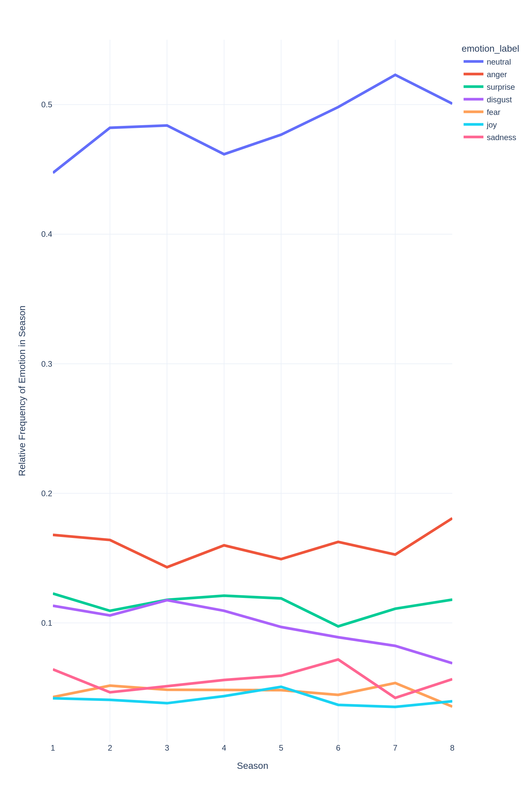

# language-analytics-assignment4
Fourth assignment for language analytics in cultural data science.
The assignment is about investigating emotion labels of passages from Game of Thrones over 8 seasons.

## Usage

The data has to be downloaded from [Kaggle](https://www.kaggle.com/datasets/albenft/game-of-thrones-script-all-seasons?select=Game_of_Thrones_Script.csv).

The downloaded csv file containing the script should be placed in a `dat/` directory.
The folder structure should look like this:
```
- dat/
    - Game_of_Thrones_Script.csv
```

#### Install requirements:

```bash
pip install -r requirements.txt
```

#### Processing 

To compute emotion scores on all passages, run the `compute_scores.py` script:

```bash
python3 src/compute_scores.py
```

This will dump the results in the `results/emotions.jsonl` folder, where each entry contains metadata about a passage along with emotions scores and highest scoring emotion label.

#### Visualization 

To produce visualizations for interpreting the results, run the `produce_visualizations.py` script.

```bash
python3 src/produce_visualizations.py
```

This will output all visualizations into the `figures/` directory.

## Results

For interpreting my results I chose to display:
1. Distributions of emotions in each season (relative frequency) on a bar plot
2. Distributions of emotions in each season in succession on a line plot so one gains better visual cues as to how the emotion arc changes over time.
3. How many of the emotion labels come from each season on a number of pie charts.

#### Emotions in each season

| Bar Plot | Line Plot |
|----------|-----------|
|||

It seems that by far the most dominant emotion in the analyzed passages is neutral, while anger, disgust and surprise are also often expressed.
While I would be hesitant to make grand conclusions about emotion arcs based on this information, some tendencies may be observed.
1. Neutral statements have grown in frequency over the seasons.
2. Disgust was more typical of earlier seasons and had a downward tendency.
3. Joy is an uncharacteristic emotion in the series, but it peaked in Season 5 even overtaking fear.
4. Season 6 had relatively more sadness than all other seasons, but dropped drastically in Season 7, right when neutral statements and fear peaked.

> I cannot provide causal explanations of these observations as I have not seen the series.


#### Distribution of Seasons in Emotions

We may gain more information about relations between emotions and seasons by investigating which seasons make up the emotions in the series.
I did this by counting Season labels in each emotion and displaying these on pie charts.


Some remarks:
1. Almost half (49.3 %) of all statements labelled with disgust come from the first three seasons, again reaffirming that this emotion was more prevelant in the show earlier. This is uncharacteristic of other emotions.
2. The highest proportion of sadness labels come from Season 6, which, as we previously observed, peaked in this season. While with all other emotions Season 6 made up about 11% of them, Sadness is 15.4% percent from Season 6.
3. We can see a similar tendency with joy, where, while Season 2 provides most passages, a relatively large portion come from Season 5 in comparison with how important Season 5 is for the rest of the emotions.

> Additionally the script will produce csv files with the CO2 emissions of the substasks in the code (`emissions/`).
> This is necessary for Assignment 5, and is not directly relevant to this assignment.

> Note: The `emissions/emissions.csv` file should be ignored. This is due to the fact, that codecarbon can't track process and task emissions at the same time.

## Potential Limitations

### Certainty scores
While the classifier gives us scores for each possible label on each passage, these scores were ignored when producing visualizations.
This way we lose a lot of information about sentences, which are ambiguous in emotional content, or contain more than one emotion.
This is likely not the best approach, and perhaps summing up label probabilities would give us a more realistic estimate of the prevalence of an emotion in a season.

### Modeling
A more scientific approach to this investigation would have been a model-based approach where we formulate a statistical model over latent parameters that produce our observations.
As it currently stands, we have gained little information about the uncertainty of our estimates or whether and how seasons are significantly different from each other, and fluctuations could be caused by random chance.

For instance we could assume that all emotion labels in a season are generated by some underlying emotion weight vector (with maybe a Dirichlet prior) and then all labels in the season are drawn from a Categorical distribution based on these weights. This way we could have uncertainty estimates for the relevance of each feeling in each season. (of course other aspects might be modeled as well) 
